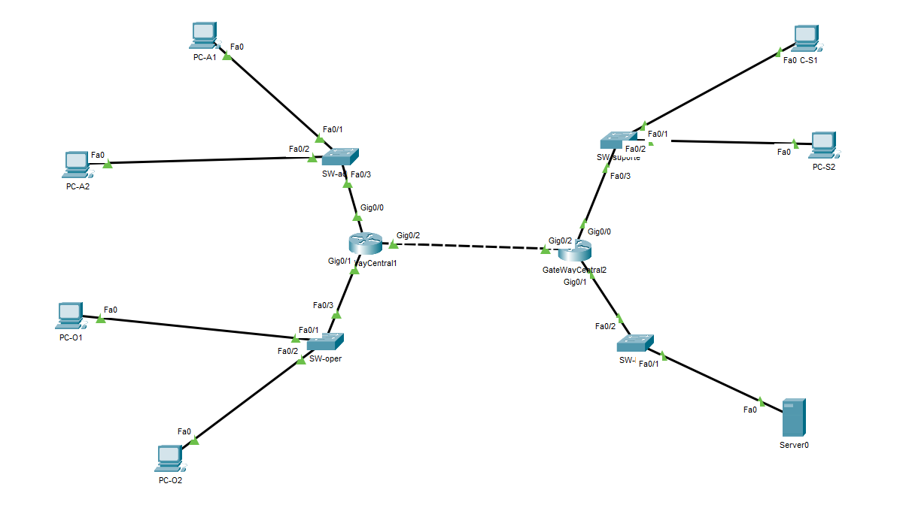

# 📘 README - Atividade de Roteamento no Packet Tracer

## 🎯 Objetivo  
O objetivo desta atividade foi configurar uma rede utilizando **roteadores e switches**, permitindo a comunicação entre diferentes segmentos de rede.  
A validação foi feita com **ping** e envio de pacotes entre os dispositivos, garantindo a conectividade de ponta a ponta.

---

## 🛠️ Topologia Implementada  
- **2 roteadores centrais** (GateWayCentral1 e GateWayCentral2) interligados para garantir comunicação entre as redes.  
- **Switches de acesso** conectados a cada roteador para distribuir a rede aos PCs.  
- **Múltiplos PCs e um servidor** simulando hosts em diferentes redes.  

📌
 

---

## ⚙️ Configurações Realizadas  
- Configuração de endereçamento **IPv4** em cada interface de roteador e PC.  
- Associação correta de **interfaces FastEthernet e GigabitEthernet**.  
- Testes de conectividade (ping entre PCs de redes distintas).  
- Envio de pacotes simulados para validar comunicação com o servidor.  

---

## ✅ Validação  
- Conectividade garantida entre **todos os PCs** da rede.  
- Comunicação estabelecida com o **servidor central**.  
- Testes de ping realizados com sucesso entre diferentes segmentos de rede.  

---

## 📂 Arquivos  
- `atividade-pocket.pkt` → Arquivo da simulação no Cisco Packet Tracer.  
- `README.md` → Documento explicativo da atividade.  

---

## 🚀 Conclusão  
A atividade demonstrou a importância do **roteamento em redes locais**, permitindo a comunicação entre diferentes segmentos e hosts.  
A configuração prática reforçou conceitos de endereçamento IP, roteamento estático e teste de conectividade.  
